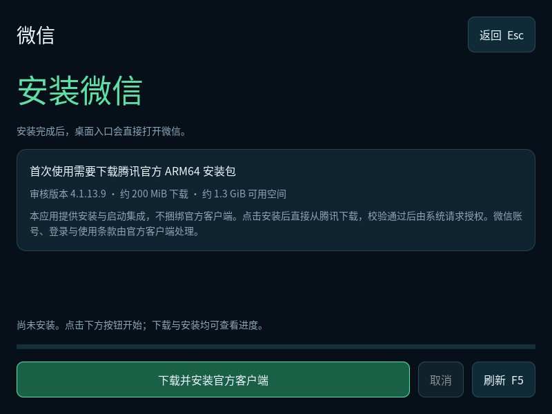

# TypixDeck 微信



截图为 CM4 独立 800×600 显示会话中的首次安装界面；使用未安装状态测试桩，不包含微信账号或登录二维码。

原生 GTK3 安装与启动集成，面向官方 Raspberry Pi OS ARM64。此仓库发布完整的 **TypixDeck 集成应用**，包含首装界面、下载、校验、授权暂存和原生启动逻辑；不包含、镜像或重新打包腾讯的官方客户端。

## 使用

从 TypixDeck Store 安装 `typix-wechat`，并在 Store 中添加桌面快捷方式。Launcher 只显示桌面快捷方式；普通桌面也可从应用菜单打开“微信”。

首次打开会展示来源、下载体积、空间要求和安装按钮，不会自动下载安装。点击“下载并安装官方客户端”后，从腾讯的固定 HTTPS 地址直接下载约 200 MiB 官方 ARM64 deb，校验通过后由系统请求暂存和安装授权。安装完成后点击“打开微信”。以后打开入口会直接启动已安装的官方客户端。

已安装时直接打开微信，不创建或显示安装页面。重复打开时复用现有微信窗口并全屏显示；关闭官方主窗口后返回 Launcher。只有尚未安装或实际启动失败时才显示安装或重试界面。官方客户端自身可能继续在托盘运行，集成不会终止它的后台进程。登录、账号数据和消息由腾讯官方客户端处理，本应用不代理登录、不读取消息，也不提供网页或浏览器替代入口。

Store 中卸载 `typix-wechat` 只会移除本集成应用；单独安装的腾讯 `wechat` 包和用户数据会保留。若要卸载官方客户端，请使用系统的软件包管理器单独移除 `wechat`，并按官方说明管理自己的微信数据。

方向键 / Tab 在控件间移动，Enter 激活，Esc 返回，F5 刷新。下载可取消并保留已下载部分供重试；系统提交期间仅采用 PackageKit 提供的安全取消机制。

## 上游来源和安全边界

- 官方网站：[微信 Linux](https://linux.weixin.qq.com/)
- 直接下载：[腾讯官方 ARM64 deb](https://dldir1v6.qq.com/weixin/Universal/Linux/WeChatLinux_arm64.deb)
- 本版审核版本：`wechat 4.1.13.9`，架构 `arm64`。
- 原始文件大小：`209059272` 字节。
- SHA-256：`a6d115d24dfe3ed1b7e7de16cf6cc02acef8df5668150f702ac8d8c5256405fa`。

腾讯地址会随上游版本更新。若大小、hash、Package、Version、Architecture、Depends 或 Installed-Size 不符，本版会拒绝安装，等待维护者审核并更新集成包。不会接受下载响应附带的新校验值。官方客户端的许可与使用条款由腾讯提供，用户在官方客户端中处理相应要求。

下载在普通用户线程中运行，有 10 秒单次网络等待、30 秒响应头期限、20 分钟总期限、读取大小限制、取消检查、续传范围校验和磁盘余量检查。响应头尚未返回时也能取消；连接工作线程最多两个，取消会关闭已建立的 socket。系统根目录建议至少保留约 1.3 GiB 可用空间，用于安全暂存、展开与恢复余量。缓存位于 `$XDG_CACHE_HOME/typix-wechat/download`（默认 `~/.cache/typix-wechat/download`）。

`pkexec /usr/libexec/typix-wechat-stage` 仅把普通用户所有的安装包复制到 root 管理的缓存，重新核对固定 pin 并写入本地系统审计日志；它使用隔离的 Python 解释器，拥有 120 秒总期限，不执行 apt/dpkg 安装、不运行 GUI。安装由普通用户界面通过 PackageKit / Polkit 发起。root 缓存路径为 `/var/cache/typix-wechat/verified/<sha256>.deb`，普通用户不能改写。

不会自动调整软件源、关闭安全沙箱、修改系统分区或切换显示 MUX。网络不可用、授权拒绝、低存储或下载源变化时，界面保留可恢复的错误状态；未知的系统事务结果需要先刷新检查，不能自动重放安装。

## 构建与测试

```sh
./build-deb.sh
PYTHONPATH=src python3 -m unittest discover -s tests -v
```

产物：`dist/typix-wechat_0.1.1-1_all.deb`。`Architecture: all` 表示本包只有 Python/GTK 集成代码；运行时仍检查官方客户端所需的 ARM64 和系统版本。运行依赖含 GTK3、Typix Store 0.3、Typix Launcher 0.2、PackageKit、pkexec、CA 证书与桌面 MIME 工具。官方包自己的字体依赖由 PackageKit 解析。

发行版声明包含 Bookworm 和 Trixie；主验收环境为 CM4 的官方 Raspberry Pi OS ARM64 Trixie。Bookworm 依赖运行时架构、系统库与显示能力检查，不能把 Trixie 的验收结果等同于已在 Bookworm 真机验收。

`upstream/`、构建产物和临时日志不进入 Git。发布时只提交集成源码、构建文件、测试、公开文档与真实截图；Store 中的条目应明确描述“官方客户端安装与启动集成”，不能把集成包的体积描述成完整微信客户端的体积。

## 仓库结构

`app.json` 提供 Store 发布识别信息；`src/` 是当前 GTK3 程序，`packaging/` 是 desktop 与授权 helper，`tests/` 是安全与生命周期测试，`docs/screenshots/` 保存真实截图，`dist/` 是不提交 Git 的构建产物。参见 [Store 仓库规范](https://github.com/typixdeck/store/blob/main/docs/APP-REPOSITORY.md)。
